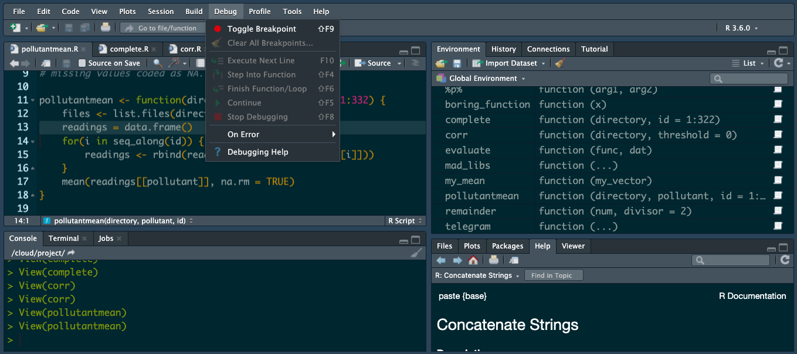

`Estadistica-Programacion-con-R` > [`Programacion con R`] > [`Sesion-03`] > [`Ejemplo-05`] 
### OBJETIVO
- Generar un script en R con tareas complejas implementadas mediante funciones

#### REQUISITOS
1. Contar con R studio.
1. Usar la carpeta de trabajo `Sesion03/Ejemplo-05`

#### DESARROLLO

R dispone de un conjunto de herramientas para depurar (debug) programas. Se debe de llegar a usar la función debug de manera casi exclusiva y cuando es necesario, pero leyendo el libro ´The Art of R Programming´ nos encontramos con una discusión sistemática sobre el proceso de depuración así como algunas herramientas adicionales.

Una de las primeras que menciona el libro es la función stopifnot, que puede ser intercalada en el código para verificar condiciones necesarias (y lanzar un error en caso de que no se cumplan):

```{r}
mi.error <- function( x ){
  res <- 1 / x
  stopifnot( ! is.infinite( res ) )
  2 * res
} 
mi.error( 2 )
mi.error( 0 )
```
Puede ser usado para anticiparse activamente a los errores.

Son, conocidas de todos las funciones debug y undebug, que permiten ejecutar código línea a línea. Una adición interesante a la familia es debugonce, que llama a debug una única vez y evita tener que eliminar explícitamente a la función undebug en situaciones similares a

```{r}
f <- function( n, x ){
  for( i in 1:n)
    g(x)
}
```

La función browser permite inspeccionar el estado de la función sin tener que llamar a debug sobre toda ella. Se le puede añadir, además, una condición para que sólo interrumpa la ejecución del programa bajo ciertas condiciones.

```{r}
mi.error <- function( x ){
  res <- 1 / x
  browser( expr = x == 0 )
  2 * res
}
 
mi.error( 2 )
mi.error( 0 )
```
Este resultado también puede obtenerse usando las funciones setBreakpoint o trace.

Finalmente, existe la posibilidad de saber qué ha pasado después del fallo de una función de R usando

```{r}
options( error = recover )
```

Con esa opción, después de un fallo, R te deja elegir el contexto que se quiere analizar. Por ejemplo:

```{r}
options( error = recover )
myFit <- lm(y ~ x, data = xy, weights = w)
Error in inherits(x, "data.frame") : object 'xy' not found

Enter a frame number, or 0 to exit   

1: lm(y ~ x, data = xy, weights = w)
2: eval(mf, parent.frame())
3: eval(expr, envir, enclos)
4: model.frame(formula = y ~ x, data = xy, weights = w, drop.unused.levels = TRUE)
5: model.frame.default(formula = y ~ x, data = xy, weights = w, drop.unused.levels = TRU
6: is.data.frame(data)
7: inherits(x, "data.frame")

Selection: 2
Called from: model.frame.default(formula = y ~ x, data = xy, weights = w, 
    drop.unused.levels = TRUE)
Browse[1]> ls()
[1] "enclos" "envir"  "expr"  
Browse[1]> Q
```

No son este tipo de herramientas aquellas a las que los programadores están más acomodaticiamente acostumbrados. De hecho, existen herramientas de depuración análogas a las que dispone Eclipse (para Java) en desarrollo para RStudio, como lo presentamos a continuación. 

Estas las podemos encontrar en la sección de debug en RStudio: 



