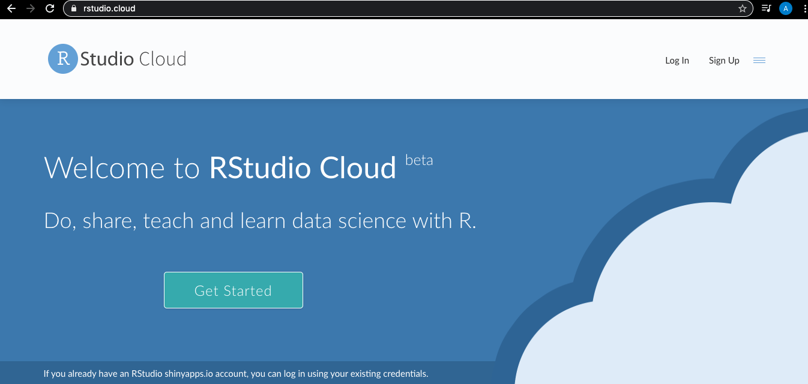
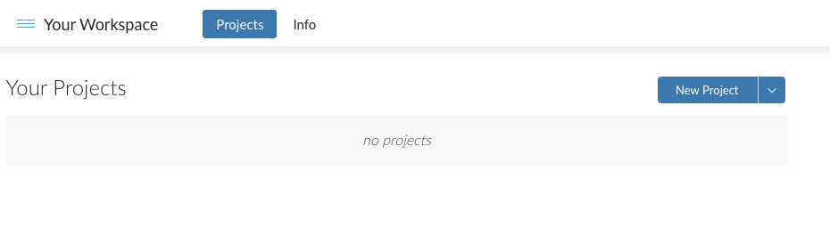
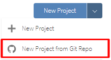
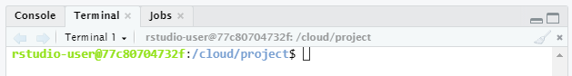
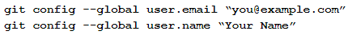
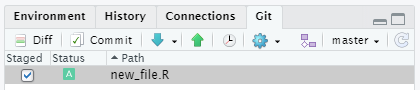
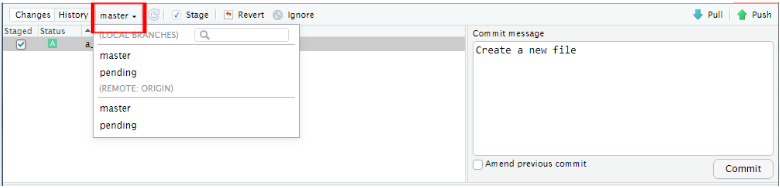
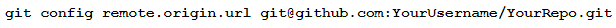
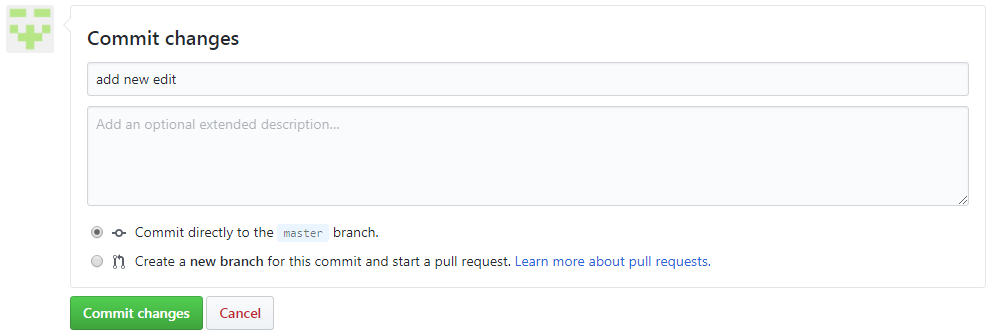
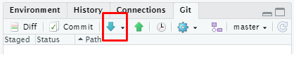

`Estadistica-Programacion-con-R` > [`Programacion con R`] > [`Sesion-04`] > [`Ejemplo-01`] 
### OBJETIVO

- Conocer el ambiente de desarrollo en la nube para RStudio específicamente RStudio Cloud.
- Conectar tu repositorio en Git Hub a RStudio.

#### REQUISITOS

- Leer prework sobre como crear una cuenta de RStudio Cloud.

#### DESARROLLO

Entramos a la dirección web: 

y creamos una cuenta en las sección de Sign Up, después hacemos Log In. 

Una vez en el workspace creamos un projecto dando click en el botón correspondiente: 

Después verémos como se inicializa nuestro front end en cloud! de RStudio. Así es como podrías trabajar con Rstudio Cloud en general.
Como podemos observar es igual al de RStudio Desktop, ahora exploraremos los objetivos de esta clase, que son las interfaces con aplicaciónes externas y repositorios.

Sin embargo, la manera más profesional de trabajar es cuando conectémos Rstudio Cloud con nuestro repositorio de trabajo en Git Hub, para esto tenemos que crear un nuevo proyecto desde el inicio con la opción de utilizar un repositorio Git Hub. Para esto sigamos las siguientes instrucciones:

### 1) Configuración de Git Hub en RStudio Cloud

1. Crear un repositorio vacío en Github

2. Crea un nuevo proyecto en RStudio Cloud: vaya a RStudio Cloud y haga click en la flecha al lado de "Nuevo proyecto". En el menú desplegable, seleccione "Nuevo proyecto de Git Repo".

Copia y pega la URL de tu repositorio de Github en el cuadro de solicitud. Ahora tu proyecto RStudio Cloud está conectado a tu repositorio de Git Hub. Cualquier cambio realizado en RStudio Cloud puede reflejarse en Github (Escenario A) y viceversa (Escenario B).

Escenario A: empuja(push) cambios en RStudio Cloud a Git Hub.

3. Configurar git en RStudio Cloud:

a. Haz click en la pestaña Terminal en el panel inferior dentro de su proyecto RStudio Cloud.

b. Dentro de Terminal, escribe los siguientes comandos pero reemplaza you@example.com con tu dirección de correo electrónico real y tu nombre con tu nombre real entre comillas:

Esto registrará cualquier cambio que realizes bajo tu identidad de usuario específica y hará un seguimiento de quién realizó qué modificaciones.

4. "Commit" cambios en Git Hub:

a. Guarda todos los archivos en RStudio Cloud que hayas editado, si aún no lo has hecho.

b. En el panel derecho, ve a la pestaña en el extremo derecho que dice "Git". En esa pestaña, deberías ver los archivos que editaste y guardaste. Haz click en el cuadro debajo de "En escena" para seleccionar el archivo que deseas actualizar en Git Hub.

c. Haz clic en el botón "Confirmar" en la barra de herramientas. Básicamente, esto guarda los cambios en Git para que puedas enviarlos a Github.

d. Aparecerá una ventana que muestra los cambios que has realizado. Coloca un mensaje de confirmación, que es una breve descripción de los cambios que hayas realizado, y haz clic en Confirmar.

5. Empuja(push) los cambios a Git Hub:

a. Elije la rama a la que deseas enviar los cambios seleccionándola en el menú desplegable y luego haz click en el botón con la flecha verde hacia arriba. (Esto también se puede hacer en la ventana principal de RStudio Cloud en la barra de herramientas de la pestaña Git).

b. Una ventana emergente te pedirá que ingreses tu nombre de usuario y contraseña para Git Hub. Sigue las instrucciones que se te indiquen.

c. Opcional: puedes ir a Git Hub y verificar tu repositorio de Github para confirmar que tus cambios se enviaron correctamente a Git Hub.

6. Evita tener que escribir el nombre de usuario y la contraseña cada vez que deseas enviar una edición a Git Hub:

a. En la barra de herramientas superior de tu proyecto RStudio Cloud, haz click en "Herramientas" y seleccione "Opciones globales ..." en el menú desplegable

b. De la lista de opciones en el lado izquierdo de la ventana emergente, selecciona Git / SVN.

c. Haz click en el botón "Crear clave RSA". Aparecerá otro mensaje emergente; haz click en "Crear". Haz click en Ver clave pública y copia la clave en el portapapeles.

d. Navega a Github y ve a tu perfil haciendo click en la esquina superior derecha donde está tu avatar y seleccionando "Tu perfil" en el menú desplegable. En el lado izquierdo de tu página de perfil, selecciona "Editar perfil".

e. Ve a "Claves SSH y GPG" y haga clic en el botón "Nueva clave SSH". Asigna un título a tu clave y pégala en el cuadro de texto Clave. Luego haz click en "Agregar clave SSH"

F. Vuelve a tu proyecto de RStudio Cloud y ve a la pestaña Terminal en el panel inferior de tu ventana. En el terminal, escribe lo siguiente, pero reemplaza YourUsername y YourRepo con tu nombre de usuario de Git Hub y el nombre del repositorio de Github (como está escrito en la URL de tu repositorio de Git Hub):

#### Escenario B: extracción de cambios de Git Hub a RStudio Cloud

1. "Commit" los cambios en Git Hub. Esto se realiza a través de un formulario en la parte inferior de tu archivo en Git Hub: completa una breve descripción de los cambios que está confirmando y selecciona "Confirmar directamente en la rama maestra". Luego haz click en "Confirmar cambios".

2. "Pull" de los cambios de Git Hub. 

a. En RStudio Cloud, ve al proyecto correspondiente de RStudio Cloud.

b. En el panel derecho, ve a la pestaña en el extremo derecho que dice "Git". En la barra de herramientas, haz click en la flecha azul que apunta hacia abajo. Esto extraerá los cambios que realizaste desde Git Hub en RStudio Cloud. El archivo debe actualizarse automáticamente después de hacer click.

