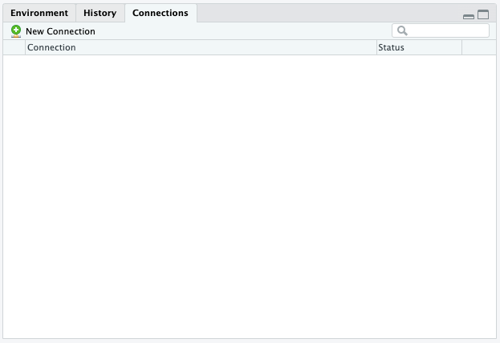
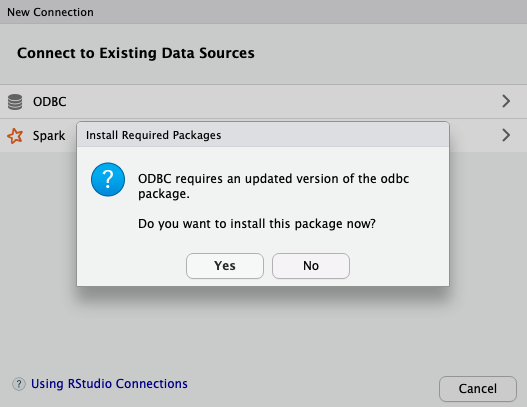

`Estadistica-Programacion-con-R` > [`Programacion con R`] > [`Sesion-04`] > [`Postwork`] 

### OBJETIVO
- Aprender a utilizar el connect pane en R para hacer interfaz con diversas aplicaciones.

- Por ejemplo, crear una conexión odbc a alguna base de datos de MySQL o Oracle, en el connection pane , dale click en new Connection y sigue los pasos que muestran las ventanas del wizard:

