`Estadistica-Programacion-con-R` > [`Programacion con R`] > [`Sesion-04`] > [`Reto-01`] 

### OBJETIVO
- Aplicar los conocimientos adquiridos en las actividades para conectarnos a un repositorio propio y Base de Datos MySQL.
- Conectar a tu propio repositorio en git Gub y almacenar un archivo csv en el repositorio creado en este Reto-01.

#### REQUISITOS
1. Contar con RStudio.
1. Usar la carpeta de trabajo `Sesion04/Reto-01`

#### DESARROLLO

### Para este reto tienes que lograr los siguientes milestones.

1. Crea tu repostiorio de trabajo para este curso, si ya lo tienes ubica el URL, sigue los siguientes pasos para hacerlo de cualquier manera. Configura Git Hub para este repositorio en RStudio Desktop de la forma en que lo hicimos para RStudio Cloud, con la diferencia de que en RStudio Desktop se selecciona el repositorio al crear un proyecto.

a. Creando Repositorio:

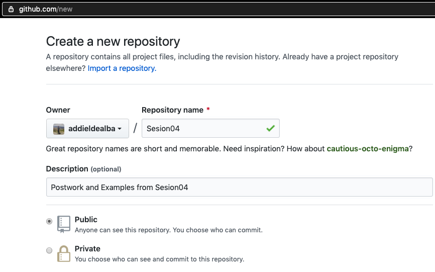

b. Crear proyecto en RStudio Desktop con nuevo repositorio:

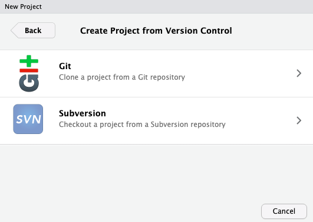

b1. Introducir el URL y el directorio donde se va a clonar el repositorio y donde trabajaremos con este Proyecto en R:

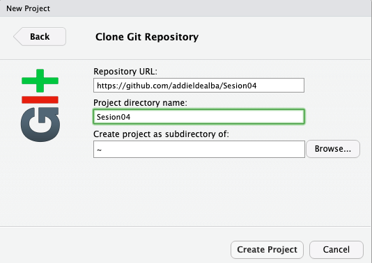

c. Confirmar que el repositorio ya se encuentre en el ambiente de nuestro Workspace en RStudio:

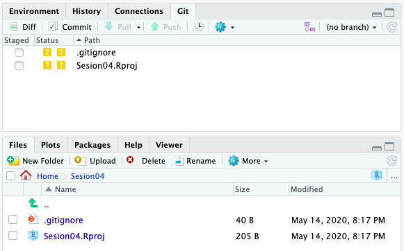

1.1 Crear test Script en R y Commit cambios en Git Hub:

a. Crear un test Script con cualquier función o texto:

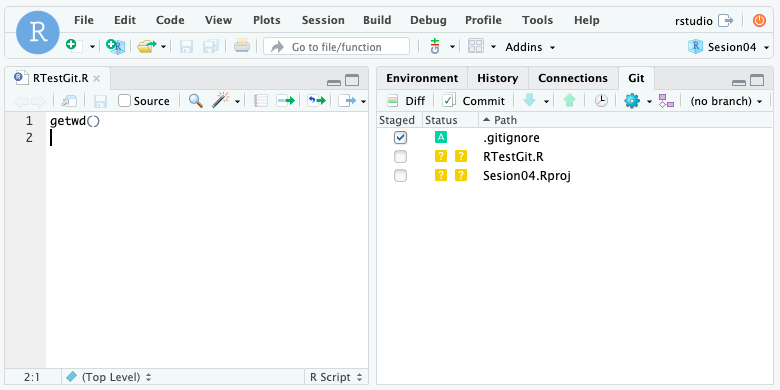

b. En el terminal, introducir con el comando git los datos personales para el log del commit:

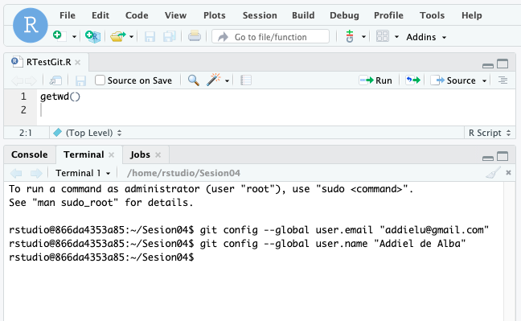

c. Seleccionar los archivos que queramos hacer push ó dar click en commit primero:

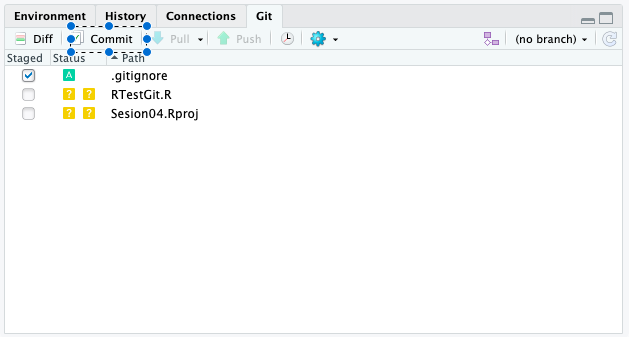

d. Seleccionar los archivos que queramos hacer commit, darle click en commit con un commit message:

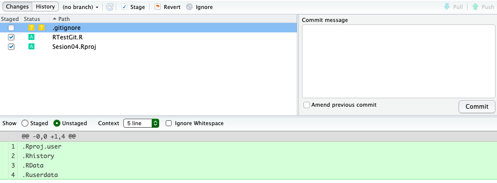

e. Confirmar el commit con el log:

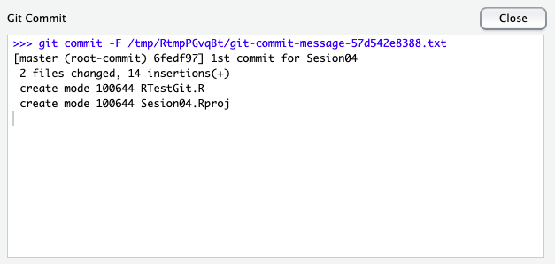

f. Introducir nuestros accessos de git hub:

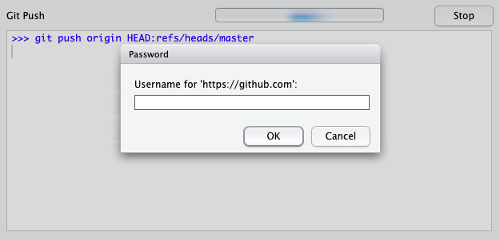

g. Introducir nuestros accessos de git hub:

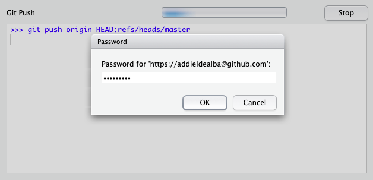

h. Confirmar los cambios al repositorio después de push:

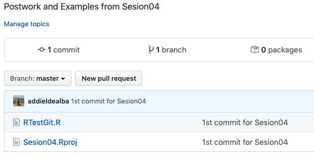

2. Conectate a la BD de prueba que proporcionamos en los Ejemplos, si no la recuerdas aquí estan los datos de conexión.

```{r}
    con <- dbConnect(
      drv = RMySQL::MySQL(),
      dbname = "shinydemo",
      host = "shiny-demo.csa7qlmguqrf.us-east-1.rds.amazonaws.com",
      username = "guest",
      password = "guest")
```
4. Importa la tabla que esta accesible gratuitamente a un data.frame, después exportalo a .csv

Por ejemplo con la Tabla City,

```{r}
DataDB = dbGetQuery(con, "select * from City")
```

5. Convierte este dataframe a un archivo csv, guardalo en tu repositorio mediante un Push desde Git Hub en R , en Terminal o en la aplicación de Git Hub Desktop.
       
